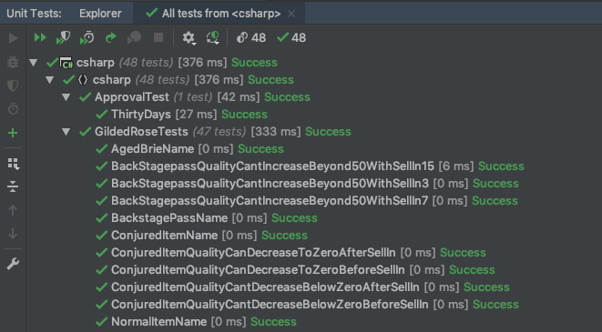

# Gilded Rose refactoring kata - C#

I worked from [Emily Bache's version](https://github.com/emilybache/GildedRose-Refactoring-Kata), but the exercise was originally devised by Terry Hughes. The original version is [here](https://github.com/NotMyself/GildedRose).

This is my attempt at the exercise in C#, a language I had never used previously.

## The exercise

The Gilded Rose is a refactoring exercise where you're given a program with a very complex nested conditional which you have to refactor so that adding the new 'conjured' functionality is easy.

[Here are the requirements.](https://github.com/emilybache/GildedRose-Refactoring-Kata/blob/master/GildedRoseRequirements.txt)

[Here's what the original code looks like.](https://github.com/emilybache/GildedRose-Refactoring-Kata/blob/master/csharp/GildedRose.cs)

The kata has been translated into many different languages. My first attempt was in JavaScript - [find the repo here](https://github.com/Hives/gilded-rose-javascript). The original creator of the kata recommends doing it in the original C# though. Emily Bache writes:

> As Bobby Johnson points out in his article ["Why Most Solutions to Gilded Rose Miss The Bigger Picture"](http://iamnotmyself.com/2012/12/07/why-most-solutions-to-gilded-rose-miss-the-bigger-picture), it'll actually give you better practice at handling a legacy code situation if you do this Kata in the original C#.

So I thought I would try it in C#, a language I had never used before.

After refactoring the conditional I implemented the new functionality by adding 3 lines to a switch/case statement.

## Running the tests

Clone the repo and open it in your C# IDE of choice. Use your IDE's test runner to run the unit and acceptance tests.

## My approach

### Get set up in C#

1. Install a C# IDE - JetBrains Rider
2. Install .NET SDK
3. Rider is asking me to install Mono, so do that
4. Update Rider with location of Mono and MSBuild
5. Ok, now I can run the acceptance test using Rider's test runner.

### Initial refactor

1. Read the requirements carefully. Understand them as well as if starting from scratch.
2. Write unit tests to cover the existing functionality, in addition to the provided acceptance test. Base understanding of functionality on:
    1. The requirements
    2. Exploring the actual functionality of the program where the requirements are ambiguous
3. Be very careful to test all edge cases - quality approaching zero, behaviour of backstage passes around SellIn date = 5 and 10. It's extra important to be careful since you're not TDDing the tests.
4. Pick apart that nested conditional. Multiple tactics, including:
    1. Where a condition is being checked multiple times, try and extract that into one conditional.
    2. Turn -ve conditionals into +ve: easier to read.
    3. Simplify complex conditionals into switch/case blocks
5. Make sure to run the tests after every change.

At this point the code is much simpler, and the logic easy to follow. [See commit](https://github.com/Hives/gilded-rose-csharp/blob/3641bc833e3ee7c4614951b322883c26425be067/GildedRose.cs).

## Further refactoring

I made two significant refactors after this point.

### SRP

In [this commit (view diff)](https://github.com/Hives/gilded-rose-csharp/commit/b75408d5018e09d7d20943c93340445f47857352) I extracted the logic from the main method into a number of private methods in the class. Now each method has a single responsibility.

It was at this point that I implemented the new functionality. It only required me to add [3 lines](https://github.com/Hives/gilded-rose-csharp/commit/d0ac8f6393b68580c639b353c2d5f24231b2318c#diff-cce539b8044ff0fd9cdff3d124ddc32b) to my `GildedRose.cs`.

### Open/closed

In [this commit](https://github.com/Hives/gilded-rose-csharp/blob/3f424ad145fc41edd737fbcf1a525272b9c8c2d5/GildedRose.cs) I extracted the creation of a mapping between items and update methods into the class constructor, away from the business logic. This brings the program more in line with the open/closed principle. New functionality could now be added without modifying the existing business logic.

## What next?

In an ideal world I would have liked to add an `Update` method to the `Item` class itself, or to have separate sub-classes for each item which would each have their own update method, called by `item.Update` (polymorphism). But the exercise requirements explicitly forbid changing the `Item` class, because it belongs to a "goblin ... who doesn't believe in shared code ownership". A real-world reason might be because we wouldn't want to require the user to change how they interact with our program.

Given that restriction, I thought an alternative might be to have an `Updater` module which could be passed any item and update it as appropriate, but I thought that if I did that then there wouldn't be any behaviour left in my `GildedRose` class, rendering it redundant.

But following [this commit](https://github.com/Hives/gilded-rose-csharp/commit/3f424ad145fc41edd737fbcf1a525272b9c8c2d5) where I separated the mapping from items to update methods from the business logic, it seems possible for a further separation of concerns - I could create an `Updater` module which would contain methods for updating items, and the `GildedRose` class would look after mapping items to the right update methods. This is something I would look into if I was going to continue this exercise, or if I attempt it again.

